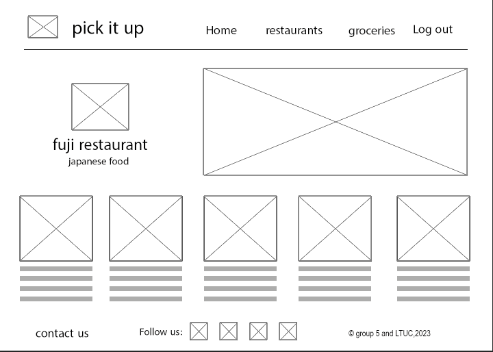

# project-ideas

this branch only to share our basic ideas on the prep project.

# project name : pick it up

the idea of this web app it to connect the customer to the resturant or the groceries shop , the idea is instead of ordering it for delivery and pay delivery fees, or buy it from the shop directly and waste your time in waiting line you can ues this website.

## how can the website help me?
 
 you can order your food or groceries on the web and pay online then the staff in the shop will be notified to prepare your order also they will be wating for you on the street because the web will provied the staff with estimated arival time, thats why you dont have to get out of your car, so you will continue your way to home and buy your stuff easily. 

## pick it up ... save time and money.

basic wireframe

home page

resturant/groceries page

join us (this page for the shops to add there business to the site)

finally this is very basic wireframe but if the decision is to  be developed it will have more pages and feachers.